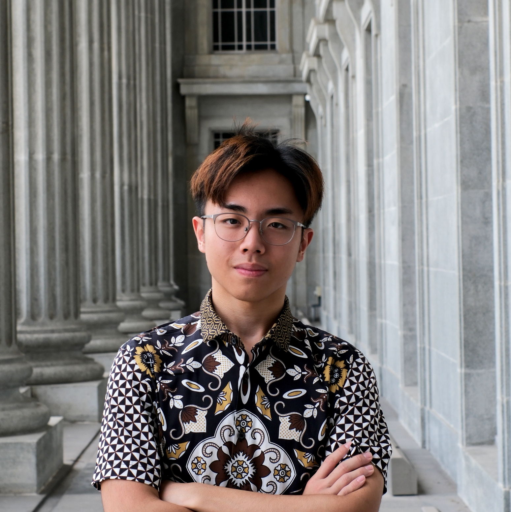
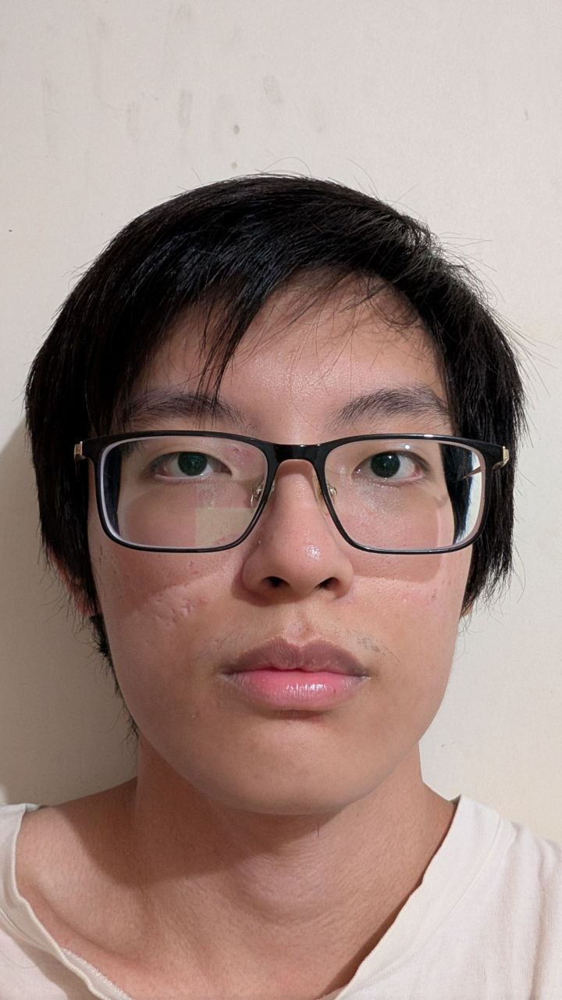
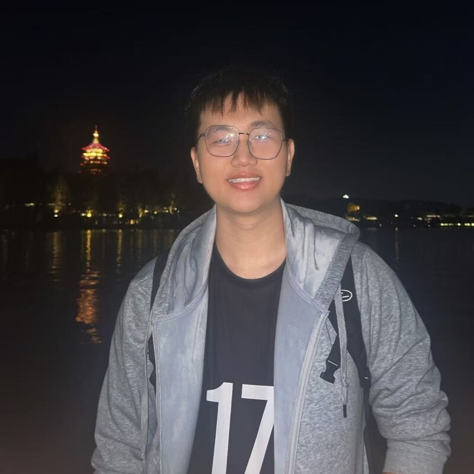
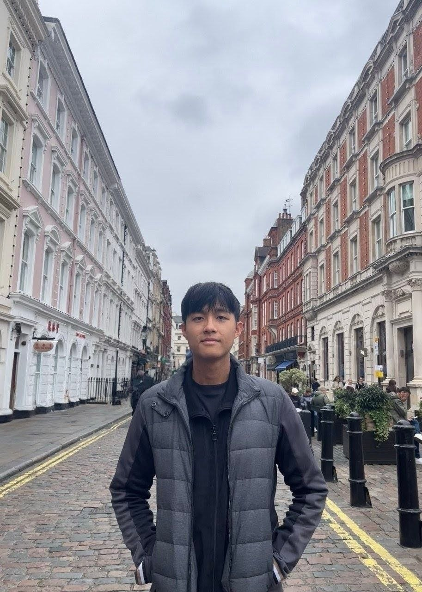

We are a team based in the [School of Computing, National University of Singapore](https://www.comp.nus.edu.sg).

You can reach us at the email `seer[at]comp.nus.edu.sg`

## Project team

### Valentino Nathan

[[github](https://github.com/valentinonathan)]
[[portfolio](team/valentino-nathan.md)]

* Role: Project Advisor
* Responsibility: UI

### Christian Alexander

[[github](http://github.com/chrsxndr)]
[[portfolio](team/chrsxndr.md)]

* Role: Developer
* Responsibilities: UI

### Gabriel Chan

[[github](https://github.com/HIIMHEY)]

* Role: Developer
* Responsibilities: Data

### Koh Wee Sheng Raynor

[[github](http://github.com/raynor-koh)]
[[portfolio](team/raynor-koh.md)]

* Role: Developer
* Responsibilities: UI

### Matthew Tan

[[github](https://github.com/matthewtansh)]
[[portfolio](team/matthewtansh.md)]

* Role: Developer
* Responsibilities: UI
