# Mentora MVP Feature Specification

This is the command contract for Mentora's first release: one Singapore tuition-centre coordinator, a local Java desktop application, and roughly 30-200 active records. It deliberately supports one guardian per student, while a guardian may be shared by many students.

## Conventions used by every command

Commands and prefixes are case-insensitive; the documented lower-case spelling is displayed in help. Prefixes may appear in any order, but every prefix may occur only once. Values may not be empty unless a command explicitly says otherwise. Unknown text, unknown prefixes, a missing required prefix, or a repeated prefix produces:

`Invalid command format. Use: FORMAT`

Leading and trailing spaces in any value are trimmed. Consecutive internal spaces in names and search queries are collapsed to one space. Therefore `Mei   Lin`, ` mei lin `, and `Mei Lin` are the same name for matching and duplicate checks. The application retains the casing supplied by the user for display, but compares names case-insensitively.

The application generates immutable identifiers (`S-0001`, `S-0002`, ... for students and `G-0001`, `G-0002`, ... for guardians). These IDs, not the current list position, are used in commands so that search results cannot cause an accidental update or deletion. An ID is an uppercase `S-` or `G-` followed by four or more digits; it is not user-editable.

### Shared value rules

| Value | Acceptable values | Error if unacceptable | Rationale |
|---|---|---|---|
| `NAME` | 1-80 characters after normalization; starts and ends with a Unicode letter; contains only Unicode letters, spaces, apostrophes, hyphens, and periods between letters. | `Name must be 1-80 characters and contain letters, spaces, apostrophes, hyphens, or periods only.` | Accommodates common Singaporean and international names (for example `Nur Aisyah`, `O'Connor`, `S. Kumar`) while rejecting numbers and accidental punctuation. |
| `ACADEMIC_LEVEL` | One of `Sec 1` through `Sec 5` or `IP 1` through `IP 6`, case-insensitive. It is stored and shown in this canonical form. | `Academic level must be Sec 1-5 or IP 1-6.` | These are the intended secondary-school levels; a closed set prevents unusable variants such as `Secondary two`. |
| `PHONE` | Either eight digits beginning with `3`, `6`, `8`, or `9`, or the same number prefixed by `+65` (with an optional single space after `+65`). It is stored as `+65 XXXXXXXX`. Hyphens, brackets, and extensions are not accepted. | `Phone number must be an 8-digit Singapore number, optionally prefixed by +65.` | The product is for Singapore centres. A canonical form makes duplicate detection and display reliable. |
| `STUDENT_ID` / `GUARDIAN_ID` | An existing generated ID with the correct prefix, for example `sid/S-0007` or `gid/G-0003`. | `Student S-0007 does not exist.` / `Guardian G-0003 does not exist.` (Use the supplied ID.) | Stable IDs make a command independent of a changing filtered list. |
| `GROUP_CODE` | An exact, case-insensitive code in the configured group catalogue. The MVP ships with subject groups `ENG`, `MAT`, `SCI`, `CHI` and class groups such as `S1-ENG-A`, `S1-MAT-A`, ..., `S5-SCI-A`; the full deployed catalogue is shown by `list-groups`. Codes are stored uppercase. | `Group CODE is not configured. Run list-groups to see available groups.` | A code is quick to type and unambiguous. Group creation is deliberately outside the MVP. |
| `QUERY` | 1-80 normalized characters that meet the `NAME` character rule; it may be a whole or partial name. | `Search query must be 1-80 characters and contain name characters only.` | Search should tolerate incomplete recollection without silently accepting arbitrary parser noise. |

## 1. Student record management

### Add student

- **Feature:** Add student
- **Purpose:** Creates a student record with its generated ID, name, and academic level. The new student initially has no guardian and no assignments.
- **Command format:** `add-student n/NAME al/ACADEMIC_LEVEL`
- **Example commands:** `add-student n/Mei Lin al/Sec 2`; `add-student al/IP 4 n/S. Kumar`
- **Parameters:** `n/` uses `NAME`; `al/` uses `ACADEMIC_LEVEL`. The shared rules above give the accepted values, exact errors, and rationale.
- **Outputs:** On success, the result panel says `Added student S-0007: Mei Lin (Sec 2).` The student list refreshes and selects the new record. On a malformed, missing, repeated, or unknown parameter, it shows the shared format error; invalid field values show their exact shared error.
- **Duplicate handling:** A student is a duplicate when normalized, case-insensitive name *and* canonical academic level are both equal to an existing student. It is rejected with `A student named Mei Lin at Sec 2 already exists.` Students with the same name at different levels are allowed, because siblings or different people can share a name; the level avoids accidentally recording the same student twice.
- **Possible errors:** If saving fails after validation, the in-memory change is rolled back and the result panel says `Could not save changes. No student was added.`

### Update academic level
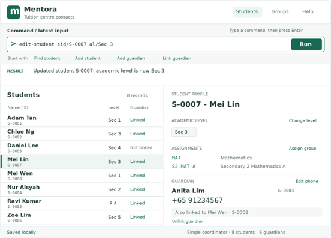
- **Feature:** Update student academic level
- **Purpose:** Changes only a registered student's academic level; its guardian and assignments remain unchanged.
- **Command format:** `edit-student sid/STUDENT_ID al/ACADEMIC_LEVEL`
- **Example commands:** `edit-student sid/S-0007 al/Sec 3`
- **Parameters:** `sid/` uses `STUDENT_ID`; `al/` uses `ACADEMIC_LEVEL`.
- **Outputs:** On success: `Updated student S-0007: academic level is now Sec 3.` The profile and any visible list row refresh. Format and field-value failures use the messages above.
- **Duplicate handling:** The proposed name plus new level is checked with the same rule as Add student. A clash is rejected with `Cannot update S-0007: a student named Mei Lin at Sec 3 already exists.` This retains the no-duplicate invariant after edits.
- **Possible errors:** An unknown ID produces the exact student-not-found message. A persistence failure rolls the change back and says `Could not save changes. Student S-0007 was not updated.`

### Delete student
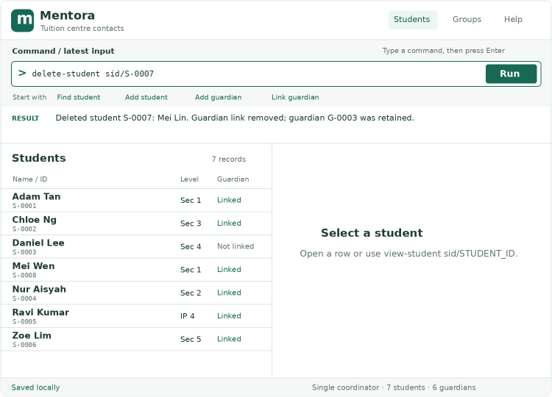
- **Feature:** Delete student
- **Purpose:** Permanently removes a student record created by mistake. If linked, only the relationship is removed; the guardian and that guardian's links to other students are retained.
- **Command format:** `delete-student sid/STUDENT_ID`
- **Example commands:** `delete-student sid/S-0007`
- **Parameters:** `sid/` uses `STUDENT_ID`.
- **Outputs:** On success: `Deleted student S-0007: Mei Lin. Guardian link removed; guardian G-0003 was retained.` If no guardian was linked, the final sentence is omitted. The list refreshes; an open profile closes. Parameter failures use the shared messages.
- **Duplicate handling:** Not applicable: an ID identifies exactly one student.
- **Possible errors:** A non-existent student reports the student-not-found message. A persistence failure leaves the student and relationship intact and says `Could not save changes. Student S-0007 was not deleted.`

## 2. Guardian record management

### Add guardian
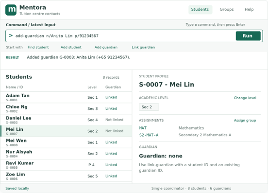
- **Feature:** Add guardian
- **Purpose:** Creates a reusable guardian contact record that may subsequently be linked to one or more students.
- **Command format:** `add-guardian n/NAME p/PHONE`
- **Example commands:** `add-guardian n/Anita Lim p/91234567`; `add-guardian p/+65 61234567 n/Raj Kumar`
- **Parameters:** `n/` uses `NAME`; `p/` uses `PHONE`.
- **Outputs:** On success: `Added guardian G-0003: Anita Lim (+65 91234567).` The guardian is available for linking immediately. Invalid, missing, repeated, and unknown parameters use the shared errors.
- **Duplicate handling:** The normalized phone number is a guardian's unique contact key. An attempted reuse is rejected with `A guardian with phone +65 91234567 already exists (G-0003). Link that guardian instead.` Guardian names alone need not be unique, because different guardians can share a name. Preventing duplicate phone contacts makes shared-family linking explicit rather than creating divergent copies.
- **Possible errors:** A save failure creates no record and says `Could not save changes. No guardian was added.`

### Update guardian phone
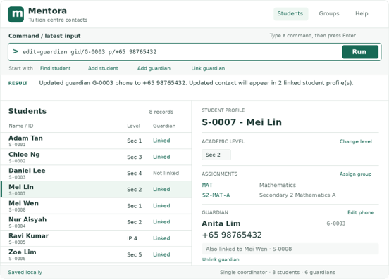
- **Feature:** Update guardian phone
- **Purpose:** Changes a guardian's single source of contact information; every linked student profile consequently displays the new number.
- **Command format:** `edit-guardian gid/GUARDIAN_ID p/PHONE`
- **Example commands:** `edit-guardian gid/G-0003 p/+65 98765432`
- **Parameters:** `gid/` uses `GUARDIAN_ID`; `p/` uses `PHONE`.
- **Outputs:** On success: `Updated guardian G-0003 phone to +65 98765432. Updated contact will appear in 2 linked student profile(s).` The currently open affected profile refreshes. Invalid values and format errors use the shared messages.
- **Duplicate handling:** The new canonical phone must not belong to another guardian. Otherwise it is rejected with `Phone +65 98765432 is already used by guardian G-0004.` This avoids silently merging two people or making a contact ambiguous.
- **Possible errors:** Unknown guardian ID reports the guardian-not-found message. A save failure leaves the old phone in place and reports `Could not save changes. Guardian G-0003 was not updated.`

## 3. Student-guardian relationships

### Link guardian
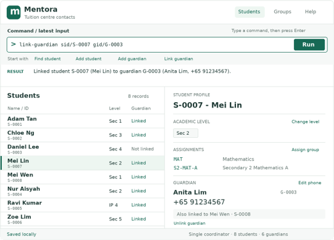
- **Feature:** Link student to guardian
- **Purpose:** Creates the student's one permitted guardian relationship. The guardian can be linked to any number of students, supporting siblings.
- **Command format:** `link-guardian sid/STUDENT_ID gid/GUARDIAN_ID`
- **Example commands:** `link-guardian sid/S-0007 gid/G-0003`; `link-guardian gid/G-0003 sid/S-0008`
- **Parameters:** `sid/` uses `STUDENT_ID`; `gid/` uses `GUARDIAN_ID`.
- **Outputs:** On success: `Linked student S-0007 (Mei Lin) to guardian G-0003 (Anita Lim, +65 91234567).` The student profile immediately shows the guardian name and number.
- **Duplicate handling:** The relationship pair is unique. Repeating the same pair reports `Student S-0007 is already linked to guardian G-0003.` A student linked to a different guardian is rejected with `Student S-0007 already has guardian G-0003. Unlink it before linking another guardian.` This enforces the MVP's one-guardian limit rather than replacing a contact unexpectedly.
- **Possible errors:** Unknown student or guardian IDs use the corresponding not-found message. A save failure creates no link and says `Could not save changes. The guardian link was not created.`

### Unlink guardian
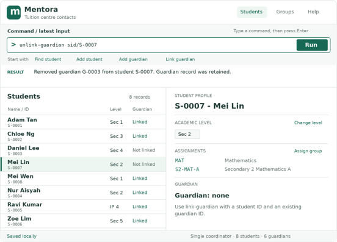
- **Feature:** Remove student-guardian link
- **Purpose:** Removes the one relationship when it was entered incorrectly, while preserving both records. This is required to correct a link before another guardian can be linked.
- **Command format:** `unlink-guardian sid/STUDENT_ID`
- **Example commands:** `unlink-guardian sid/S-0007`
- **Parameters:** `sid/` uses `STUDENT_ID`.
- **Outputs:** On success: `Removed guardian G-0003 from student S-0007. Guardian record was retained.` The profile displays `Guardian: none`.
- **Duplicate handling:** Not applicable.
- **Possible errors:** No link produces `Student S-0007 has no guardian to unlink.` Unknown ID and save failures report the corresponding standard not-found or `Could not save changes. The guardian link was not removed.` message.

## 4. Subject and class assignment

### View configured groups
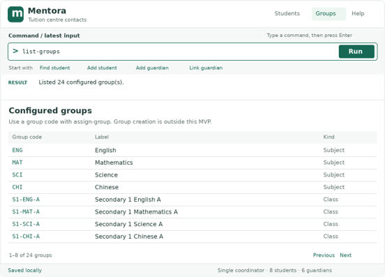
- **Feature:** Browse configured groups
- **Purpose:** Shows the fixed subject and class groups which can be assigned in this MVP.
- **Command format:** `list-groups`
- **Example commands:** `list-groups`
- **Parameters:** None.
- **Outputs:** The main list shows group code, label, and kind (Subject or Class), for example `MAT | Mathematics | Subject` and `S2-MAT-A | Secondary 2 Mathematics A | Class`. Result panel: `Listed 24 configured group(s).`
- **Duplicate handling:** Configuration must contain unique case-insensitive group codes; startup rejects a catalogue with duplicates using `Configured group codes must be unique.`
- **Possible errors:** Extra input reports `Invalid command format. Use: list-groups`. If the catalogue cannot be read at startup, the application reports the storage recovery error described below and does not permit assignments.

### Assign group
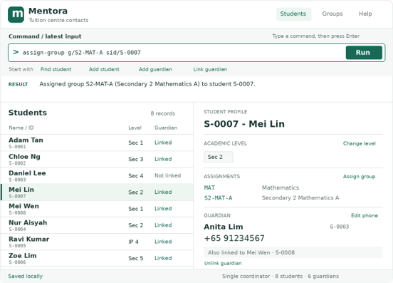
- **Feature:** Assign student to subject or class group
- **Purpose:** Adds one existing configured group to a student's profile. A student may hold multiple distinct assignments, such as `MAT` and `S2-MAT-A`.
- **Command format:** `assign-group sid/STUDENT_ID g/GROUP_CODE`
- **Example commands:** `assign-group sid/S-0007 g/MAT`; `assign-group g/S2-MAT-A sid/S-0007`
- **Parameters:** `sid/` uses `STUDENT_ID`; `g/` uses `GROUP_CODE`.
- **Outputs:** On success: `Assigned group S2-MAT-A (Secondary 2 Mathematics A) to student S-0007.` The profile's Assignments section refreshes.
- **Duplicate handling:** A student cannot have the same canonical group code twice. It is rejected with `Student S-0007 is already assigned to S2-MAT-A.` Different groups, including both a subject and a class group, are allowed because they convey distinct information.
- **Possible errors:** Unknown ID, unavailable group, format problems, and save failures respectively show the exact shared message or `Could not save changes. The group was not assigned.`

### Remove group assignment
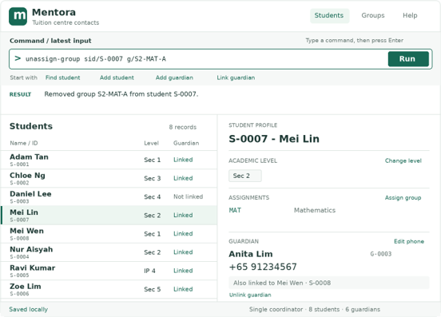
- **Feature:** Remove student group assignment
- **Purpose:** Removes an obsolete subject or class assignment without changing the configured group catalogue. This is necessary when a student changes subject or class.
- **Command format:** `unassign-group sid/STUDENT_ID g/GROUP_CODE`
- **Example commands:** `unassign-group sid/S-0007 g/S2-MAT-A`
- **Parameters:** `sid/` uses `STUDENT_ID`; `g/` uses `GROUP_CODE`.
- **Outputs:** On success: `Removed group S2-MAT-A from student S-0007.` The profile refreshes.
- **Duplicate handling:** Not applicable; assignments are a set.
- **Possible errors:** If the valid configured group is not assigned to that student: `Student S-0007 is not assigned to S2-MAT-A.` Unknown IDs, invalid codes, format errors, and persistence failures use the messages established above; the last is `Could not save changes. The group assignment was not removed.`

## 5. Student browsing and search

### List students
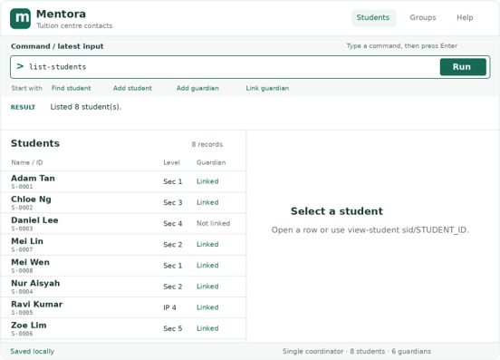
- **Feature:** Browse all students
- **Purpose:** Shows every registered student, sorted by normalized name and then ID, so the coordinator can scan records.
- **Command format:** `list-students`
- **Example commands:** `list-students`
- **Parameters:** None.
- **Outputs:** The main panel shows ID, name, academic level, and guardian status for every student; the result says `Listed 18 student(s).` An empty database says `No students registered.`
- **Duplicate handling:** Not applicable.
- **Possible errors:** Extra input reports `Invalid command format. Use: list-students`.

### Search students by name
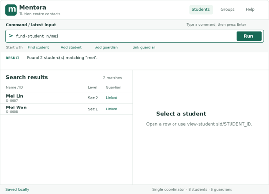
- **Feature:** Search students
- **Purpose:** Narrows the main list to students whose normalized name contains the normalized query as a case-insensitive substring.
- **Command format:** `find-student n/QUERY`
- **Example commands:** `find-student n/mei`; `find-student n/Mei Lin`
- **Parameters:** `n/` uses `QUERY`. A query may match part of a name: `mei` matches `Mei Lin`; it does not search guardian names, levels, or assignments.
- **Outputs:** The main panel displays matching rows and says `Found 2 student(s) matching "mei".` A valid search with no results says `No students match "mei".`
- **Duplicate handling:** Not applicable: every matching student is displayed.
- **Possible errors:** An invalid or omitted query reports its exact shared error or the format error.

### Open student profile
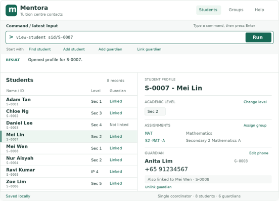
- **Feature:** View student profile
- **Purpose:** Opens a full read-only profile for one student, including academic level, every assignment (code and label), and the linked guardian's name and canonical phone number, or `Guardian: none`.
- **Command format:** `view-student sid/STUDENT_ID`
- **Example commands:** `view-student sid/S-0007`
- **Parameters:** `sid/` uses `STUDENT_ID`.
- **Outputs:** On success, the detail panel title is `S-0007 - Mei Lin`, with sections for Academic level, Assignments, and Guardian. Result panel: `Opened profile for S-0007.`
- **Duplicate handling:** Not applicable: ID is unique.
- **Possible errors:** An unknown ID shows its exact student-not-found message. A profile never shows stale guardian contact data: it obtains the guardian by ID from the current guardian record when displayed.

## 6. Keyboard-first operation, help, and local storage

### Command help
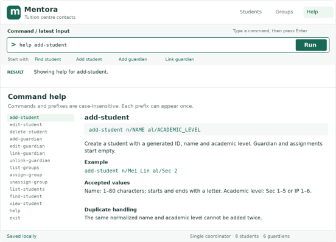
- **Feature:** Command help
- **Purpose:** Lets a keyboard-only user discover the command syntax and validation rules.
- **Command format:** `help [COMMAND]`
- **Example commands:** `help`; `help add-student`; `help link-guardian`
- **Parameters:** `COMMAND` is optional and must be one documented command name, case-insensitively; it has no prefix.
- **Outputs:** `help` opens/foregrounds the help panel with all commands. `help add-student` opens that command's syntax, examples, validation, and common errors. Result panel says `Showing help for add-student.`
- **Duplicate handling:** Not applicable.
- **Possible errors:** An unrecognised command says `No help is available for "COMMAND". Run help to see all commands.` More than one word reports `Invalid command format. Use: help [COMMAND]`.

### Local storage and reload
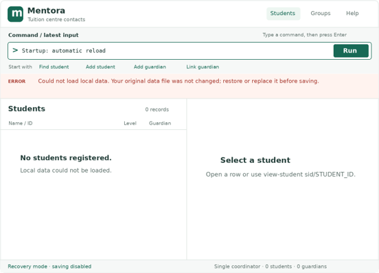
- **Feature:** Automatic local persistence
- **Purpose:** Saves the whole model after every successful state-changing command and reloads it when Mentora reopens; no account, network, or manual save command is needed.
- **Command format:** No user-entered persistence command. `exit` closes the application after pending writes have completed.
- **Example commands:** `exit`
- **Parameters:** `exit` accepts none; extra input gives `Invalid command format. Use: exit`.
- **Outputs:** A successful modifying command reports its domain success message only; the status bar shows `Saved locally`. On launch after a valid load it shows `Loaded 18 students and 12 guardians from local storage.` `exit` says `Closing Mentora.`
- **Duplicate handling:** The persisted model is validated against the same student, guardian, link, and assignment uniqueness rules before it replaces the in-memory model.
- **Possible errors:** A write error rolls back the triggering command and shows its specified `Could not save changes...` message. If the data file is malformed, has duplicate IDs, dangling guardian IDs, unknown group codes, or cannot be read, Mentora preserves the original file, starts with an empty recovery model, disables saving, and displays `Could not load local data. Your original data file was not changed; restore or replace it before saving.` This prevents corrupt data from being overwritten.

## Command summary

| Action | Format |
|---|---|
| Add student | `add-student n/NAME al/ACADEMIC_LEVEL` |
| Edit student level | `edit-student sid/STUDENT_ID al/ACADEMIC_LEVEL` |
| Delete student | `delete-student sid/STUDENT_ID` |
| Add guardian | `add-guardian n/NAME p/PHONE` |
| Edit guardian phone | `edit-guardian gid/GUARDIAN_ID p/PHONE` |
| Link / unlink guardian | `link-guardian sid/STUDENT_ID gid/GUARDIAN_ID` / `unlink-guardian sid/STUDENT_ID` |
| List groups | `list-groups` |
| Assign / remove group | `assign-group sid/STUDENT_ID g/GROUP_CODE` / `unassign-group sid/STUDENT_ID g/GROUP_CODE` |
| List / find students | `list-students` / `find-student n/QUERY` |
| View profile | `view-student sid/STUDENT_ID` |
| Help / exit | `help [COMMAND]` / `exit` |
