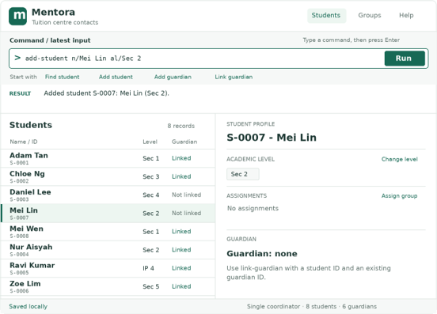

**Mentora** is a keyboard-first, local desktop application for coordinators of small private tuition centres in Singapore. It is designed for one coordinator managing 30–200 secondary-school students and their guardians, keeping student profiles, academic levels, subject or class assignments, and guardian links together so contacts can be found and updated quickly with typed commands.

* To learn how to use the application, start with the [_Quick Start_ section of the **User Guide**](UserGuide.html#quick-start).
* To learn how to build and extend the application, see the [**Developer Guide**](DeveloperGuide.html).
* Meet the project team on the [**About Us**](AboutUs.html) page.

**Acknowledgements**

* This project is based on the AddressBook-Level3 project created by the [SE-EDU initiative](https://se-education.org).
* Built with JavaFX, Jackson, and JUnit 5.
